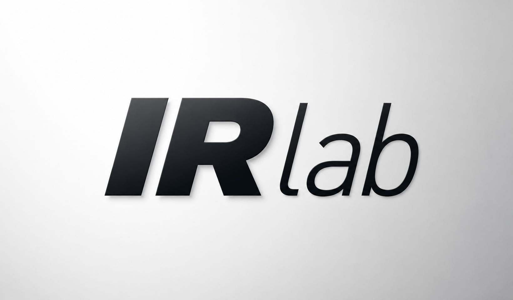

<p align="center">
  
</p>

<h1 align="center">IR Lab</h1>

<p align="center">
  Experimental Information Retrieval Systems & Algorithms
</p>
# Information Retrieval Lab

This repository is an educational and experimental lab for studying information retrieval concepts through small, modular Python implementations. The current focus is on building reusable abstractions for documents, queries, indexes, and text-processing pipelines rather than shipping a complete production retrieval system.

## Purpose

The project is intended for learning and prototyping:

- core IR abstractions such as documents, datasets, queries, and retrievers
- index and query-processing components that can be tested independently
- simple retrieval experiments and future evaluation hooks

## Current Architecture

The codebase is organized around a small set of Python modules:

- src/core/models: shared data models and retrieval abstractions
- src/core/models/querries: query abstractions
- src/core/models/excutable_querries: executable query implementations such as boolean AST queries
- src/core/models/indexes: index abstractions and storage structures
- src/processing: processing pipeline components
- src/processing/analyzing: analysis and linguistic processing modules
- src/processing/querry_transformers: query transformation steps
- src/retrieval: retriever implementations and retrieval abstractions

## Project Structure

```text
.
├── datasets/                  # corpora and sample datasets
├── docs/                      # notes and technical write-ups
├── scripts/                   # dataset download helpers
├── src/                       # implementation modules
│   ├── core/models/           # document, query, index, and retriever abstractions
│   └── processing/            # linguistic and query transformation pipelines
└── README.md
```

## Recent Changes

The repository has recently evolved around a more explicit boolean-retrieval workflow:

- separated query abstractions from executable query implementations
- introduced boolean RPN query and transformer support for representing and converting boolean expressions
- wired binary retrieval around query-specific parsers and evaluators
- added a retrieval abstraction layer and refreshed the toy inverted-index experiment configuration to exercise the new transformer path
- removed older retriever scaffolding that was superseded by the current layout

## Design Philosophy

The project favors:

- modularity over monolithic implementations
- extensibility for adding new models and experiments
- experiment-driven development over premature optimization

## Current State

The repository currently contains:

- document and dataset model abstractions
- query and executable-query representations, including boolean AST and boolean RPN variants
- a simple index base class and inverted-index experiment configuration
- linguistic pipeline and query transformation components
- a foundation for binary retrieval and future evaluation work

## Roadmap

Planned work includes:

- boolean retrieval support
- inverted and positional index extensions
- TF-IDF and vector-space retrieval
- BM25 and other ranking models
- evaluation pipelines and benchmark comparisons
