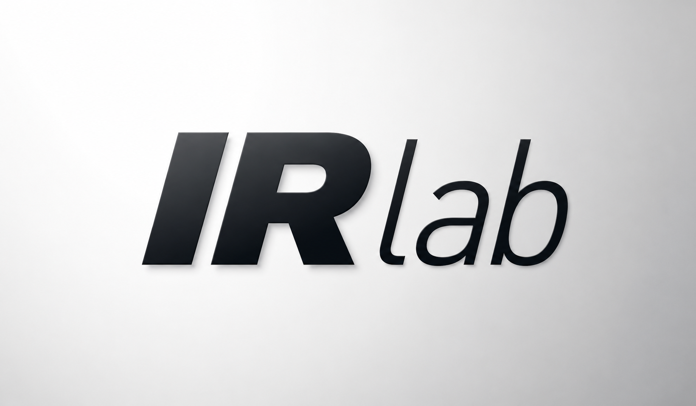

<p align="center">
  
</p>

<h1 align="center">IR Lab</h1>

<p align="center">
  Experimental Information Retrieval Systems & Algorithms
</p>

IR Lab is an educational and experimental Python package for studying information retrieval concepts through modular implementations. Compared with earlier toy-oriented versions, the current codebase is organized around a more explicit IR-style pipeline with separate packages for ingestion, analysis, indexing, retrieval, evaluation, and experiments.

## Purpose

The project is intended for learning and prototyping:

- core IR abstractions such as documents, datasets, queries, and retrievers
- reusable text-analysis components such as tokenizers, filters, and analyzers
- index and query-processing components that can be tested independently
- experiment scaffolding for defining datasets and composing retrieval pipelines

## Current Architecture

The source tree is now organized into a small set of Python packages under src/ir_lab:

- core/: experiment runner and component-builder utilities for composing IR components from configuration
- analyzing/: tokenizers, filters, analyzers, and analysis-result types
- indexing/: index abstractions and indexer implementations
- ingestion/: loader abstractions for bringing documents into the pipeline
- models/: documents, analyzed documents, queries, executable queries, datasets, experiments, and tokens
- retrieval/: parsers and retriever scaffolding for query execution
- evaluation/: evaluation package stubs for future metrics and benchmarking

## Project Structure

```text
.
├── experiments/               # experiment configuration and runner assets
├── src/ir_lab/                # implementation modules
│   ├── analyzing/             # analysis pipeline components
│   ├── core/                  # experiment runner and component composition helpers
│   ├── evaluation/            # evaluation scaffolding
│   ├── indexing/              # index abstractions and indexer implementations
│   ├── ingestion/             # data-loading abstractions
│   ├── models/                # document, query, dataset, and experiment models
│   └── retrieval/             # parsers and retriever interfaces
└── README.md
```

## What the Codebase Includes Today

The repository currently contains:

- document and analyzed-document models
- query and executable-query representations, including boolean AST and boolean RPN variants
- analyzer pipelines with character filters, tokenizers, and token filters
- dataset abstractions such as Dataset, DatasetConfig, and DatasetStore
- experiment runner and component-builder scaffolding for assembling retrieval components
- indexing and retrieval skeletons for future implementation work

## How It Differs from Older Versions

The project has moved beyond its earlier toy-style layout:

- older versions focused on simple loaders and placeholder experiment scaffolding
- the current version reorganizes the package around a more standard IR pipeline structure
- analysis logic now lives in a dedicated analyzing package instead of the older processing-oriented layout
- models, indexing, retrieval, and evaluation are separated into clearer abstractions

## Design Philosophy

The project favors:

- modularity over monolithic implementations
- extensibility for adding new models, analyzers, and retrieval components
- experiment-driven development over premature optimization

## Roadmap

Planned work includes:

- boolean retrieval support and query evaluation improvements
- inverted and positional index extensions
- TF-IDF, BM25, and other ranking models
- evaluation pipelines and benchmark comparisons
- more complete examples and end-to-end experiments
